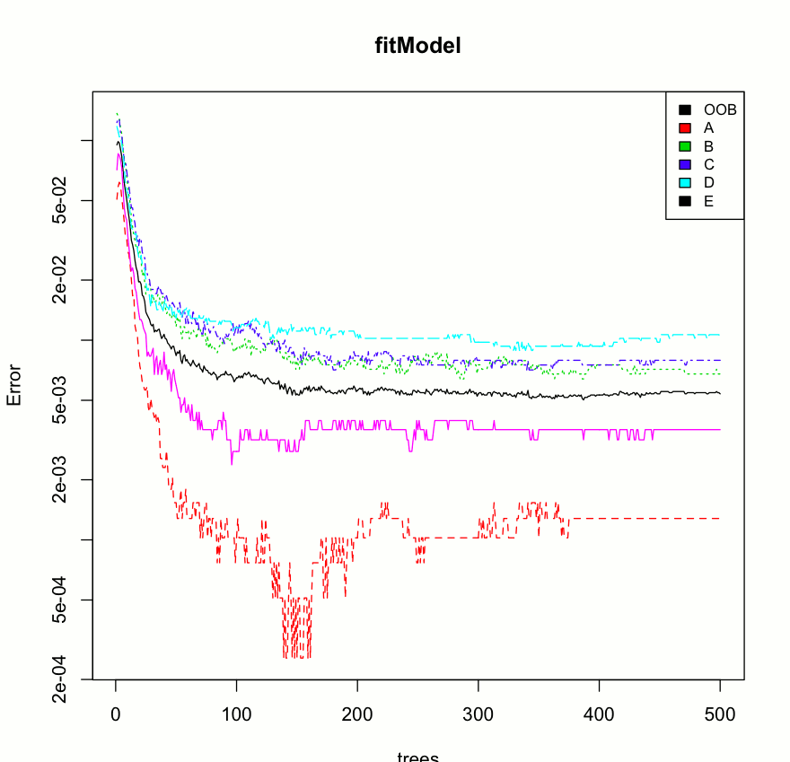

In this project, our goal will be to use data from accelerometers on the belt, forearm, arm, and dumbell of 6 participants. They were asked to perform barbell lifts correctly and incorrectly in 5 different ways. 
The data for this project come from this source: http://groupware.les.inf.puc-rio.br/har.

##1. Data Preparation
First we need to clean the data by handling missing values and eliminating columns that have too many missing values or that are not relevant to our analysis.
We finally split our data into 2 sets, one for model training, the other for testing.
```{r, eval=FALSE}
#read data and replace missing values and NA strings by NA values
rawdata<-read.csv("pml-training.csv",na.strings=c("","NA"))  

#remove NA columns
rem = NULL
for(col.nr in 1:dim(rawdata)[2]){
  if(sum(is.na(rawdata[, col.nr])) > 500){
    rem = c(rem, col.nr)
  }
}
rawdata1<-rawdata[, -rem]

#remove useless columns
rawdata2<-rawdata1[, -c(1:7)]  

#split data
finalData<-rawdata2
set.seed(125)
inTrain = createDataPartition(finalData$classe, p = 0.7, list=FALSE)
training = finalData[ inTrain,]
testing = finalData[-inTrain,]
```

##2. Model Fitting
We are going for a Random Forest model
```{r, eval=FALSE}
fitModel<-randomForest(classe~.,data=training)
```

##3. Cross Validation
Cross validation allows us to expect an out of sample error of 0.99
```{r, eval=FALSE}
predRF<-predict(fitModel,newdata=testing)
resRF<-table(predRF,testing$classe)
confusionMatrix(resRF)
```
Overall Statistics
                                          
               Accuracy : 0.9946          
                 95% CI : (0.9923, 0.9963)
    No Information Rate : 0.2845          
    P-Value [Acc > NIR] : < 2.2e-16       
                                          
                  Kappa : 0.9931            

